# DRAGFALL

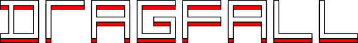

An unfaithful tribute to a great modern block stacker

---

<a href="https://www.kesiev.com/dragfall/">Play</a> | <a href="https://discord.gg/TeAWvnuGku">Discord</a>

---

    
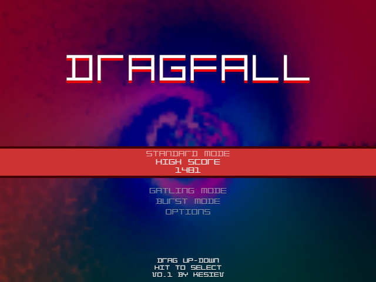

## The game

Drag any block horizontally on the field to drop it, create lines, and remove them. Each time you move a block, new ones will fall from above. Survive as long as you can!

Oh, I almost forgot. You can also move incoming blocks!

## The story

A long time ago, I used to play the original [Slydris](https://en.wikipedia.org/wiki/Slydris) on my ancient iPhone 3G. It was a golden age, where developers were looking for ways to create new touchscreen-based games, drawing inspiration from the entire history of gaming. Clearly, all eyes were on the most famous block stacker in history, but despite several attempts, I found that game to be the most distant and yet successful of the experiments.

18 years later, I found myself still convinced of it... and in sudden abstinence.

Now, with an Android device, I went looking for it only to discover that not only it [had a gorgeous sequel](https://www.radiangames.com/games.html) in 2018, which was released for Android the following year... but **both titles** are also no longer playable on Android.

The only thing left for me was [a flashy video](https://www.youtube.com/watch?v=8aIl04q01Bc) to see and nothing more. I've [praised the Gods for a re-release](https://www.youtube.com/watch?v=8aIl04q01Bc&lc=UgyI4GmlMtaXNzA1hW94AaABAg) and then... nothing.

A few days later, I decided to dedicate all my breaks to creating something that _resembled it_. I didn't need anything too fancy or faithful. I needed a link to click to release the _dopamine and addiction_ in case I needed it.

I know there are plenty of _casual-game-themed_ clones already out there. But my heart still lives in the '90s. I need `.XM` music, flashing lights, kaleidoscopic animations, and 8-bit sound effects while I stack my blocks.

That's why this game is here.

## The project

### The graphic

Squares, shadows, glows, particles, and no sprites should be enough to give the game the _retro laser look_ I like. I just paired it with a cool font: the [Y224](https://ggbot.itch.io/y224-font) by [GGBotNet](https://ggbot.itch.io/) is futuristic, edgy, and almost unreadable. Simply perfect.

    
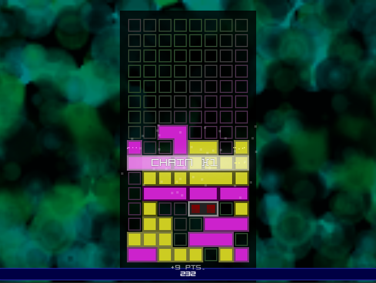

    
Just you and the blocks

### The gameplay

The original idea was to create a single game mode, without any menus. You go to a webpage, tap/click on the screen, and play.

I started implementing the core gameplay, some special blocks, and a _Standard game_ mode inspired by both the original game sequel _(videos...)_ and some modern block-stacker games aesthetics/progression.

    
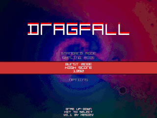

    
Stacking blocks and clearing lines

The resulting game was a bit more complex than the first game, so I fiddled with the configurations to create something that reminded me of it. The strategy needed to play this alternative mode was slightly different than the _Standard mode_, so I sped it up and named it _Gatling mode_.

    
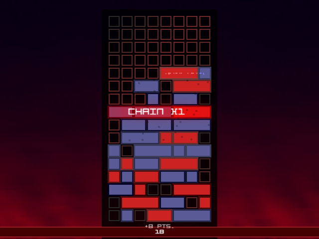

    
Gatling mode

This forced me to create a menu system, to which I then added some game settings.

Looking for videos of the first game, I remembered that I used to play _Survival mode_ the most, in which blocks appeared in bursts after 10 seconds instead of at every move. I hammered it into the code and added a flower-themed _Burst mode_.

    
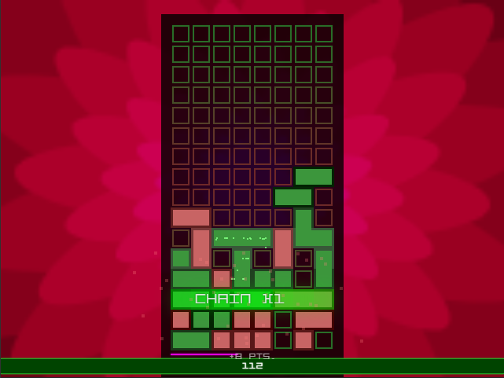

    
Burst mode

There is a lot of room for creating more game modes and new gameplay ideas, but 3 modes ~~are~~ were more than enough for me.

#### More game modes

Feeling a little lonely? So am I! After release, I've added the _Yinyang mode_, which basically is a classic Vs. mode against _yourself in the past_.

The game records the garbage you generate for ~30 seconds, and then it sends that back to you in the following ~30 seconds with the same timing. You can cancel incoming garbage stacking higher combos in 10-second rounds _à la tug-of-war_, but then you'll have to fight _that better version of you_. The game will unleash _your fury against yourself_, level after level. Have fun!

    
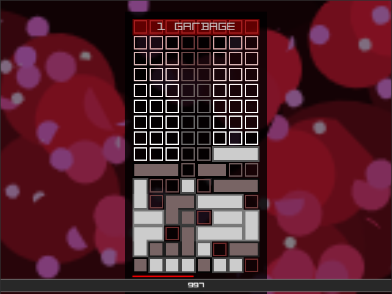

    
Yinyang mode

Anyway, I've tried to make creating new modes [fairly](js/gamemodes.js) [simple](https://www.kesiev.com/dragfall/assets/modesdump.html), just in case.

#### The quick drop button

I usually keep working on my pet project until the result does the job and there is no feedback from the Internet. Someone asked for the _quick drop button_ implementation from the original game: if the pile is low enough, you can summon a burst of blocks to play with.

I hadn't implemented it because it didn't seem necessary for this on-the-fly implementation. I was wrong: after implementing it, I remembered using it often to keep the game's pace high and score even more points. Many modes are now more fun and gain an interesting strategic layer, like in _Yinyang mode_.

    
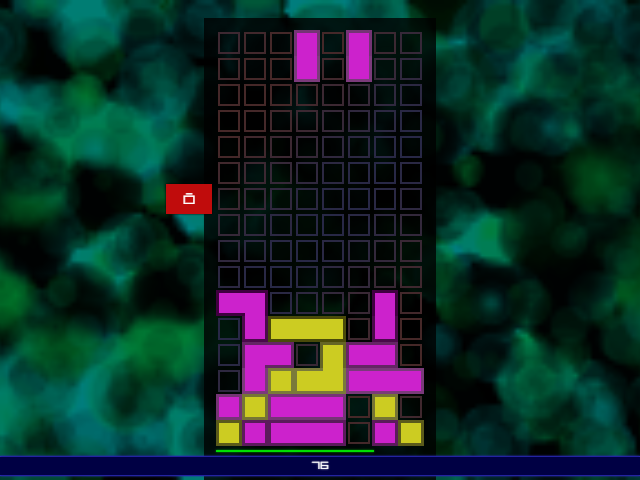

    
The Quick Drop button (red in Standard mode)

#### Even more game modes

The quick save and quick drop features had a specific purpose: implement the requested _Chill mode_. In this mode, there are no timers and no falling blocks as you move them. You can tidy up your blocks at your pace and ask for a few more using quick drops. The quick save feature will save it on your device as you close the page, so you can come later and take care of your pile. Since the summer holidays are approaching, I gave it a "beach" theme.

    
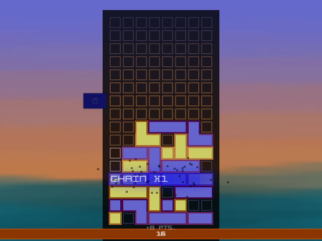

    
Chill mode

...And, after a timeless mode, what about a _timed one_? _40 Lines mode_ is quite a classic in Tetris games: you have to clear 40 lines as fast as you can. After tidying up the game modes definition file and reworking the game timers, I've added a _40-Lines mode_. You can't gain _color gems_ or get any special block in this mode, so it's all about your stacking skills.

    
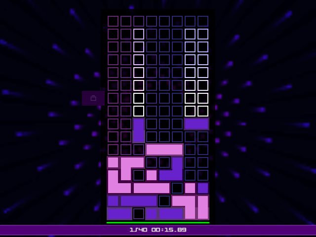

    
40-Lines mode

#### BragBoard&trade;

Our trusty Preuk asked on Discord for a highscore page to list scores from all modes in a single ~~ego trip screenshot~~ screen. Since he's a long-time good cyberfriend, I've created a whole highscore-sharing system instead, inspired by [Rewtro](https://github.com/kesiev/rewtro): introducing **BragBoard&trade;**!

    
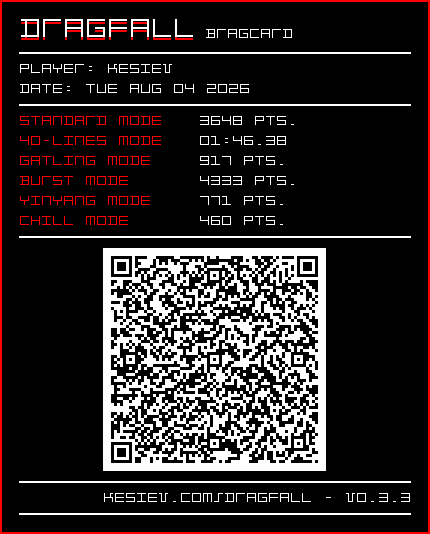

    
My launch day BragCard&trade;! In my defense, I declare that I cleared my highscores and played each mode just once.

You can ~~brag~~ share your highscores with friends via [BragCards](markdown/bragcard.png) (Old-school forums inspired images), [BragLinks](https://www.kesiev.com/dragfall/#BRGQlJHOjAuMTpEUkY6MC4zLjM7S2VzaWVWOjE3ODU4MjU5OTMyNzA7U1QvMi8zNjQ4OjQwLzEvMTA2Mzg5LjgwMDAwMDAwMDI4OkdULzIvOTE3OkJVLzIvNDMzMzpZWS8yLzc3MTpDSC8xLzQ2MDs5ODgzNjI0MDk0ODgxMg==) (Plain weblinks), or **BragQRs** (QR-Codes displayed in-game). BragQRs just contain a BragLink, so they can be scanned with any QR-Code scanner. Anyway, I've slammed a BragQR reader in DRAGFALL too, so you can easily scan multiple of them in-game.

Shared scores (called Brags) are just aside your regular highscores. On the mode selection screen, you can see who is bragging about their highscore. If you've beaten him, it will be shamefully grayed out, so you can _feed your ego_ every time you see that.

    
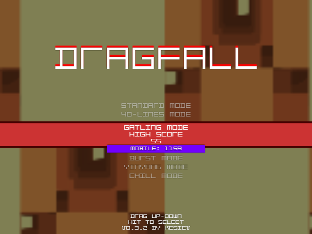

    
"Mobile" bragged his Gatling Mode score!

Ah, bragging to your friends about your scores. Now it's truly summer.

### The animations

On mobile, there is almost no room for background animations as the field covers the entire screen. On desktop, instead, there is a lot of space around it - as for most of the block stacking games - so I started looking for some abstract psychedelic animations to show in the background.

It's an area I'm not very knowledgeable about, but there are several libraries that can help me, especially thanks to the _(unbearable)_ trend of abstract and interactive backgrounds that websites have today.

But I wanted to try something different.

I wholeheartedly respect the code golfing community, but the [Dwitter](https://www.dwitter.net/) scene is the one I follow most passionately. With a `CANVAS` node and 140 characters of JavaScript code only, people can make gorgeous art. It's _sick_.

    
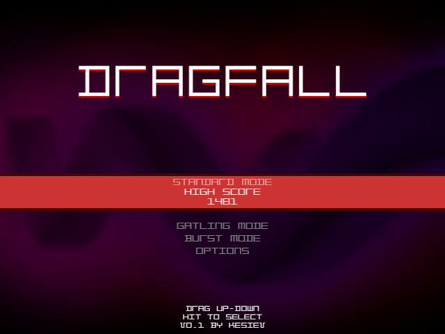

    
The <a target=_blank href='https://www.dwitter.net/d/9672'>Smokey 3D structure with joey's shadow</a> dweet running on the title screen

I've created [something](js/background.js) to wrap these code chunks and use them as game background animations. I've added some hacks to render them at different qualities, as they are often not hardware-accelerated.

_The original authors are in the credits, and I hope this little tribute will please them. However, I'm not entirely sure what license these snippets are under. If you'd like me to remove (or include) your animation, please contact me!_

#### A pinch of drama

[Someone](https://github.com/KeronCyst) posted an intriguing [request](https://github.com/kesiev/dragfall/issues/3) on GitHub, asking for some _dramatic effects_ on good plays. Sadly, I haven't received any notification about that, and it got lost for a few days. I've added some bullet time, brighter and larger particles, and a pulsating background.

    
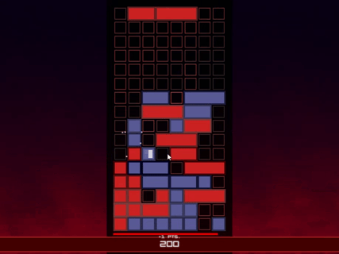

    
The longer the combo, the more the effects

It uses of the [particles](js/particles.js), [field effects](js/fieldeffect.js), and [background](js/background.js) parameters I already implemented. I left out the [text sparks](js/textspark.js) since the effect wasn't cool and readable enough. The UI, gameplay, and VFX timer split I made for the _40-Lines mode_ also came in handy, as I applied different scales to them to create the slowdown effect.

### The music

Oh, my beloved [The Mod Archive](https://modarchive.org/). I've looked for some nice `.XM` tunes there and used the [jsxm](ttps://github.com/a1k0n/jsxm) library to play them. I love club, acid, and funky atmospheres depending on the expected block stacking pace. Hope you'll like it too.

_Authors are in the credits, and songs should be under the [Mod Archive Distribution license](https://modarchive.org/index.php?terms-upload). If you'd like me to remove (or include) your song, please contact me!_

### The controls

Someone on Reddit asked for multiple control schemes, so I've added keyboard and gamepad support. The game is very different when played with buttons!

    
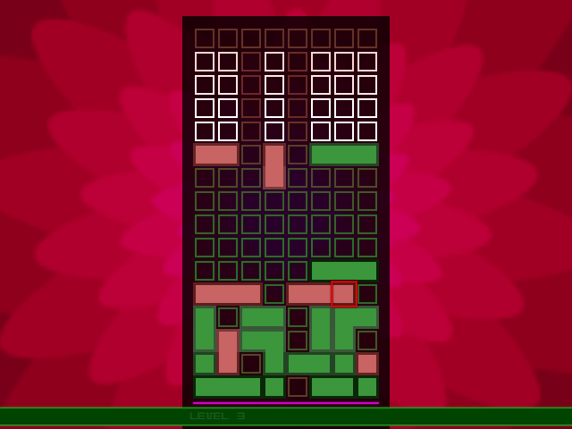

    
When using buttons, you play by moving a blinking cursor around the grid

### The NetPlay

I'm not getting much feedback on this game... but that won't stop me from adding more things. Although the _Yinyang mode_ is designed to challenge yourself, there is a mode that is essential when facing a rival/friend. Ever since the days of the Game Boy, players have been battling it out by hurling trash at each other in block-based puzzle games. Now that feature is here, too.

    
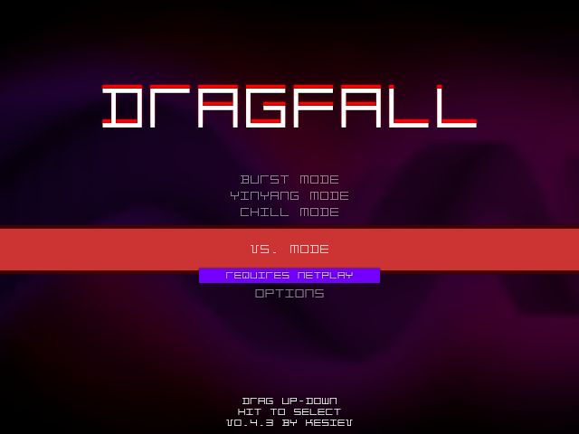

    
The VS. Mode

Ages ago, in [PvP](https://github.com/kesiev/pvp), I added LAN multiplayer up to 4 players using [PeerJS](https://peerjs.com/) to trade bullets with my wife and nephews. This time I'm adding a classic 1-on-1 _VS. Mode_ to challenge my wife once again, this time in vanilla JavaScript, using `RTCPeerConnection`, and a dash of PHP to let peers exchange offers via Room ID. It's a bit rushed, but it should be flexible enough for me to add even more 2-player modes in the future. Maybe.

### The extras

The game works natively on multiple resolutions with optional scaling, fullscreen, offline, and it can be installed on your device. I wanted to be able to _always_ stack.

Some modes have longer games, and I found myself having to interrupt them on several occasions. I decided to add an optional quick save feature: when the game is closed, the state is saved and automatically reloaded when reopened.

### Credits

#### Font

 - [Y224](https://ggbot.itch.io/y224-font) by GGVBotNet

#### Animations

 - [strange life forms](https://www.dwitter.net/d/35900) by luta, rodrigo.siqueira
 - [d/933](https://www.dwitter.net/d/933) by p01
 - [d/701](https://www.dwitter.net/d/701) by by sigveseb
 - [Smokey 3D structure with joey's shadow](https://www.dwitter.net/d/9672) by yonatan, joeytwiddle, donbright
 - [Rotating raster rings](https://www.dwitter.net/d/34861) by dee-gomma
 - [d/34124](https://www.dwitter.net/d/34124) by rodrigo.siqueira, UEZ
 - [d/1369](https://www.dwitter.net/d/1369) by tomkh
 - [Infinite #flower remix cycle](https://dwitter.net/d/17621) by DaSpider, pavel
 - [Circle Factory](https://www.dwitter.net/d/14063) by KilledByAPixel
 - [d/7242](https://www.dwitter.net/d/7242) by yonatan
 - [A blue-to-magenta hyperspace tunnel with persistent luminous trails](https://www.dwitter.net/d/35918) by ichrvk
            
#### Music

 - [Acid Attack](https://modarchive.org/index.php?request=view_by_moduleid&query=149203) by resound/pepper
 - [Club Train](https://modarchive.org/index.php?request=view_by_moduleid&query=137268) by Heywood / Gollum & Nebula Vibes
 - [Club Desire](https://modarchive.org/index.php?request=view_by_moduleid&query=151625) by tawan, qp, dcm, evt
 - [Clubb Mix Star](https://modarchive.org/index.php?request=view_by_moduleid&query=150792) by bohema recordz crew
 - [Clubbing on Delirium](https://modarchive.org/index.php?request=view_by_moduleid&query=194537) by Origin/Nemesis
 - [Funk is a Religion](https://modarchive.org/index.php?request=view_by_moduleid&query=134285) remix by dj Fulanito, original by /diesel
 - [Ying Yang](https://modarchive.org/index.php?request=view_by_moduleid&query=138705) by KemperBoyd1974
 - [Rainy Day](https://modarchive.org/index.php?request=view_by_moduleid&query=159887) by Chromag/talent

#### Sound effects

 - [8-Bit Sound Effect Pack](https://opengameart.org/content/8-bit-sound-effect-pack) by [OwlishMedia](https://opengameart.org/users/owlishmedia)
  
#### Libraries

 - [jsxm](https://github.com/a1k0n/jsxm)
 - [QR-Code generator](https://github.com/kazuhikoarase/qrcode-generator)
 - [Instascan](https://github.com/schmich/instascan)
 
#### Thanks

  - [Bianca](https://www.linearkey.net/)
  - [Preuk](https://mastodon.social/@Preuk@framapiaf.org)
  - Dymonika _(Suggested new DRAGFALL features on Reddit)_
